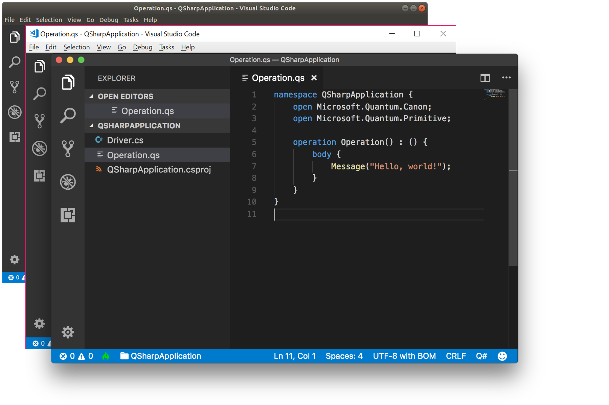

---
# Mandatory fields.
title: Setting up the Q# development environment 
author: QuantumWriter
ms.author: Alan.Geller@microsoft.com 
ms.date: 12/11/2017
ms.topic: article
# Use only one of the following. Use ms.service for services, ms.prod for on-prem. Remove the # before the relevant field.
# For Quantum products none of these categories have been defined  yet.
# ms.service: service-name-from-white-list
# ms.prod: product-name-from-white-list
# ms.technology: tech-name-from-white-list
---

# Installing the Quantum Development Kit

The Quantum Development Kit can be used either with the Visual Studio 2017 integrated development environment, or with the command line and a development editor such as Visual Studio Code.

<table>
<tr>
<td>
> [!div class="nextstepaction"]
> [Install for Visual Studio 2017 on Windows 10](xref:microsoft.quantum.install.vs-2017)
</td>

<td>

> [!div class="nextstepaction"]
> [Install for Visual Studio Code on Windows 10, macOS, or Linux](xref:microsoft.quantum.install.vs-code)
</td>
</tr>
</table>

> [!NOTE]
> The Quantum Development Kit requires a 64-bit installation of Windows 10, macOS, or Linux.
> Microsoft's quantum simulator, installed with the Quantum Development Kit, utilizes Advance Vector Extensions (AVX), and thus can run significantly more efficiently on an AVX-enabled CPU.
> The Quantum Development Kit will still run on non–AVX enabled CPUs, but may not be as efficient.
> Intel processors shipped in Q1 2011 (Sandy Bridge) or later support AVX.

